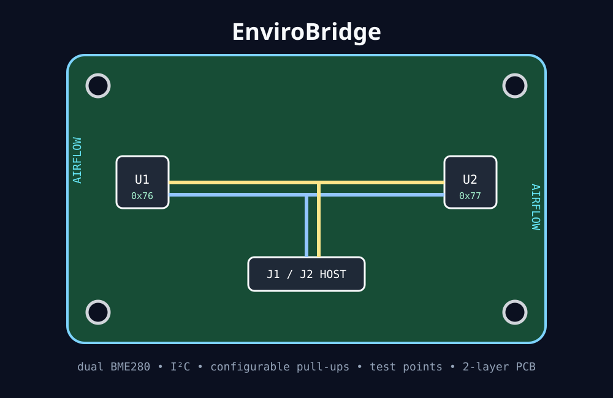
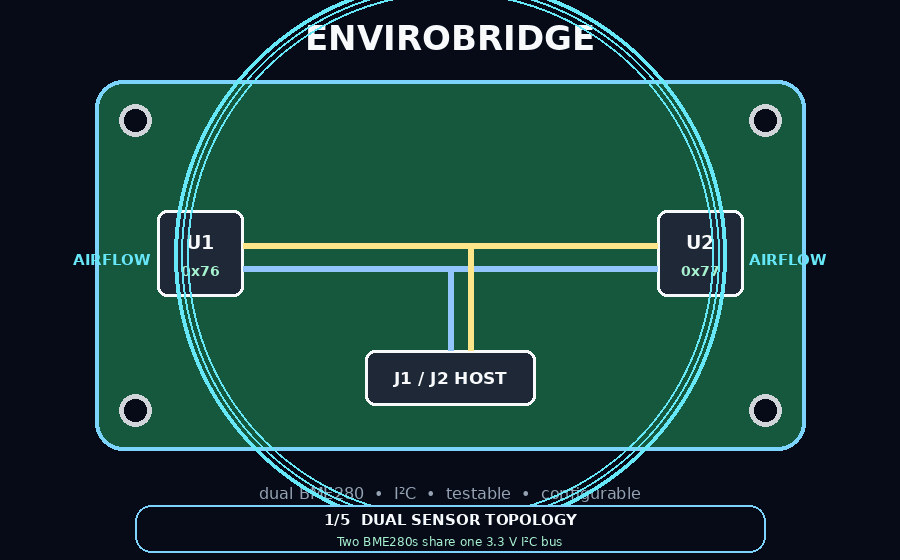
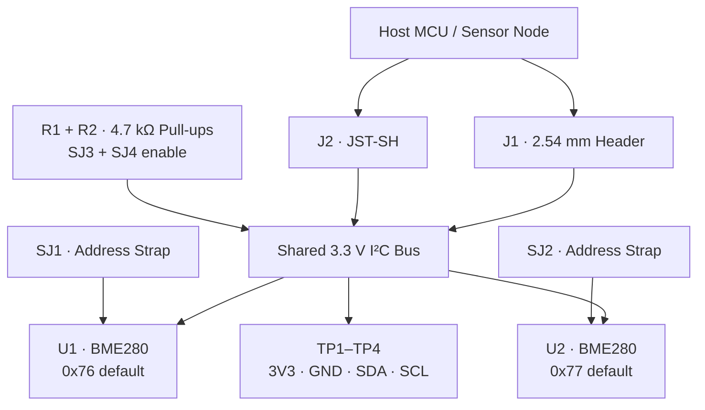
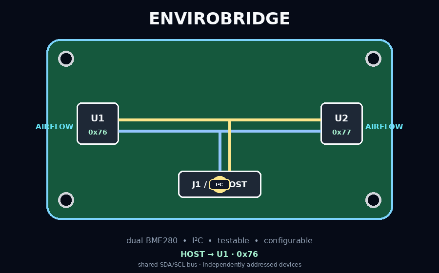

<div align="center">



# EnviroBridge

### Dual-BME280 environmental sensor daughterboard · designed and routed in KiCad

A compact **34 × 26 mm, 2-layer 3.3 V sensor board** that places two Bosch BME280 environmental sensors on one shared I²C bus while preserving independent addressing, configurable pull-ups, direct test access, and two host-connector options.

<p>
  
  
  
  
</p>

<p>
  <a href="EnviroBridge.kicad_pcb"><strong>PCB Layout</strong></a>
  &nbsp;·&nbsp;
  <a href="EnviroBridge.sch"><strong>Schematic</strong></a>
  &nbsp;·&nbsp;
  <a href="bom.csv"><strong>BOM</strong></a>
  &nbsp;·&nbsp;
  <a href="design-review.md"><strong>Design Review</strong></a>
  &nbsp;·&nbsp;
  <a href="bringup-checklist.md"><strong>Bring-up</strong></a>
</p>


</div>

---

## Board tour

<p align="center">
  
</p>

EnviroBridge is built around a simple hardware problem: **one MCU, two identical environmental sensors, one I²C bus**.

The board solves the integration details around that core problem instead of treating the sensors as isolated breakout modules. Address selection, pull-up ownership, decoupling, connector choice, debug access, mounting, airflow exposure, and board-level routing all live in one coherent design.

---

## At a glance

| | |
|---|---|
| **Board** | 34 × 26 mm · 2-layer FR-4 |
| **Supply** | 3.3 V |
| **Sensors** | 2 × Bosch BME280 |
| **Bus** | Shared I²C |
| **Default addresses** | U1 = `0x76` · U2 = `0x77` |
| **Pull-ups** | 2 × 4.7 kΩ, individually disconnectable |
| **Local decoupling** | 100 nF per sensor |
| **Bulk capacitance** | 4.7 µF at board entry |
| **Host connectors** | JST-SH 4-pin + 2.54 mm 1×4 header |
| **Debug access** | 3V3 · GND · SDA · SCL test points |
| **Mechanical** | 4 × M2.5 mounting holes |
| **Grounding** | B.Cu ground plane |

---

## System architecture



### Shared bus, independently addressed devices

<p align="center">
  
</p>

Both sensors see the same SDA and SCL lines, but the SDO strap makes them independently addressable. The default assembly uses **0x76 for U1** and **0x77 for U2**, allowing the host to communicate with both devices without an I²C multiplexer.

---

## Design details

<table>
<tr>
<td width="50%" valign="top">

### Address flexibility

Each BME280 gets its own **3-pad SDO strap** between GND and 3V3.

That turns the sensor address into an assembly-time configuration instead of a hard-wired board assumption.

</td>
<td width="50%" valign="top">

### Pull-up ownership

The board includes **4.7 kΩ SDA/SCL pull-ups**, but each path is disconnectable through a solder jumper.

That lets EnviroBridge operate as a self-contained bus endpoint or join a system where pull-ups already exist.

</td>
</tr>
<tr>
<td width="50%" valign="top">

### Local power conditioning

Each sensor has a dedicated **100 nF ceramic capacitor** close to its supply pins.

A **4.7 µF bulk capacitor** sits near the incoming 3.3 V connection to support the board locally.

</td>
<td width="50%" valign="top">

### Built-in observability

Dedicated **3V3, GND, SDA, and SCL test pads** make power checks and logic-analyzer access straightforward without touching the BME280 LGA pads.

</td>
</tr>
<tr>
<td width="50%" valign="top">

### Sensor placement

The two BME280 packages sit near opposite board edges to improve exposure to ambient air and reduce coupling to the connector-heavy center of the PCB.

</td>
<td width="50%" valign="top">

### Host flexibility

A **JST-SH 4-pin connector** supports compact sensor-node wiring while a **2.54 mm header** keeps the board easy to use on the bench.

</td>
</tr>
</table>

---

<details>
<summary><strong>Electrical architecture</strong></summary>

### BME280 operating mode

The sensors are configured for I²C operation. SDA and SCL are shared across both devices; CSB is held in the appropriate state for I²C operation and SDO determines address selection.

### Address map

| Sensor | Default strap | Address |
|---|---|---:|
| U1 | SDO → GND | `0x76` |
| U2 | SDO → 3V3 | `0x77` |

### Connector pinout

| Pin | Signal | Function |
|---:|---|---|
| 1 | GND | Ground reference |
| 2 | 3V3 | Board supply |
| 3 | SDA | I²C data |
| 4 | SCL | I²C clock |

Both host connectors expose the same logical interface.

</details>

<details>
<summary><strong>PCB layout strategy</strong></summary>

### Layer usage

- **F.Cu** — components and primary signal/power routing
- **B.Cu** — ground plane
- 3V3 routed wider than the low-current I²C traces
- direct SDA/SCL paths without decorative length matching
- mounting holes kept outside active routing areas

### Placement priorities

1. BME280s near opposite board edges
2. local decoupling beside each sensor
3. host connectors grouped along the lower board edge
4. pull-up network close to the shared bus
5. test points positioned for direct bench access
6. address straps accessible after assembly

The board is intentionally a **low-speed sensor interface**, so the layout favors short, readable routing and a clean return plane.

</details>

<details>
<summary><strong>Bring-up sequence</strong></summary>

1. Inspect sensor orientation and solder-jumper configuration.
2. Check 3V3-to-GND resistance before applying power.
3. Apply current-limited 3.3 V.
4. Verify 3V3 and GND at the dedicated test points.
5. Scan the I²C bus for `0x76` and `0x77`.
6. Read BME280 chip ID `0x60` from both devices.
7. Capture SDA/SCL with a logic analyzer if bus behavior needs inspection.
8. Compare temperature, humidity, and pressure readings between U1 and U2.

The complete checklist lives in [`bringup-checklist.md`](bringup-checklist.md).

</details>

<details>
<summary><strong>Fabrication notes</strong></summary>

The current design targets a conventional 2-layer FR-4 process:

- 1.6 mm nominal board thickness
- 1 oz copper
- lead-free HASL or ENIG
- 0.20 mm trace / clearance capability or better
- four M2.5 NPTH mounting holes
- BME280 LGA assembly requires careful paste/reflow handling

See [`fabrication/fab-notes.md`](fabrication/fab-notes.md) for the complete notes.

</details>

---

## Bill of materials

| Reference | Qty | Component | Function |
|---|---:|---|---|
| U1, U2 | 2 | Bosch BME280 | temperature / humidity / pressure |
| C1, C2 | 2 | 100 nF ceramic | local sensor decoupling |
| C3 | 1 | 4.7 µF ceramic | input bulk capacitance |
| R1, R2 | 2 | 4.7 kΩ | I²C pull-ups |
| SJ1, SJ2 | 2 | 3-pad solder jumper | BME280 address configuration |
| SJ3, SJ4 | 2 | 2-pad solder jumper | pull-up enable / bypass |
| J1 | 1 | 1×4 2.54 mm header | bench / debug host interface |
| J2 | 1 | JST-SH 4-pin | compact host interface |
| TP1–TP4 | 4 | SMD test point | 3V3 / GND / SDA / SCL |
| H1–H4 | 4 | M2.5 NPTH | board mounting |

[`bom.csv`](bom.csv) contains the repository BOM.

---

## Project files

```text
envirobridge-kicad/
├── EnviroBridge.kicad_pcb          ← routed 2-layer board
├── EnviroBridge.sch                ← schematic source
├── EnviroBridge.kicad_pro          ← KiCad project
├── EnviroBridge.kicad_dru          ← design constraints
├── bom.csv                         ← bill of materials
├── design-review.md                ← electrical + layout rationale
├── bringup-checklist.md            ← board validation sequence
│
├── docs/
│   ├── board-overview.svg          ← board architecture graphic
│   ├── board-tour.gif              ← generated animated board tour
│   ├── i2c-flow.gif                ← generated bus-flow animation
│   └── pinout.md                   ← host connector pinout
│
├── fabrication/
│   └── fab-notes.md                ← fabrication / assembly notes
│
└── .github/
    ├── scripts/
    │   └── generate_readme_assets.py
    └── workflows/
        └── readme-assets.yml       ← regenerates README animations
```

---

## Reproducible visual documentation

The animated diagrams in this README are generated from source by a small Pillow script and rebuilt through GitHub Actions.

```text
generate_readme_assets.py
          │
          ▼
   GitHub Actions
      ┌───┴─────────────┐
      ▼                 ▼
board-tour.gif     i2c-flow.gif
```

That keeps the project visuals versioned alongside the hardware instead of treating documentation as an external artifact.

---

## Project status

- [x] electrical architecture defined
- [x] dual-address BME280 topology
- [x] connector + test-point strategy
- [x] schematic source
- [x] 2-layer PCB layout
- [x] ground-plane strategy
- [x] BOM
- [x] bring-up procedure
- [x] fabrication notes
- [x] generated README animations
- [ ] final KiCad ERC / DRC pass on the target workstation
- [ ] physical fabrication and bench validation

---

<div align="center">

**Designed as a complete sensor-interface board: from bus topology and component decisions through layout, test access, documentation, and bring-up.**

</div>
